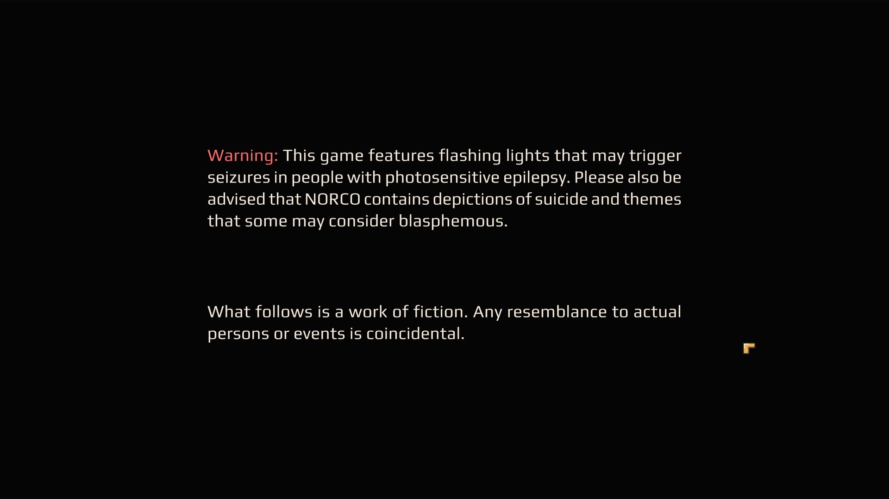
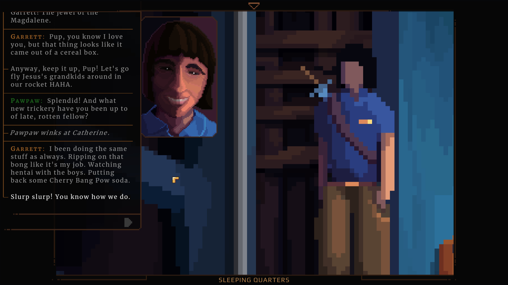

So here's the thing, I picked up _Norco_ almost immediately after I finished _Paradise Killer_ but I struggled to get through the first chapter at the time because a lot of the early subject matter is just so heavy. Like look at this game's content warning screen:

<!--more-->

You know I love some blasphemy though and I'm glad I returned. It's not a long game or particularly hard, and it's on GamePass for the time being so I really recommend picking it up!

_Norco_ is really a game for the 2020s, touching on themes such as:

- environmental racism and injustice
- health insurance-induced poverty
- gig work
- the relationship/dichotomy between big tech and the petrochemical industry
- internet-radicalized young white men
- cryptocurrency
- robots and artificial intelligence
- and more!

My favorite thing about _Norco_ is the Southern Gothic + sci-fi setting. It feels like the future but the _very_ near future. There's sapient robots and you can upload your memories into a hard drive, but like, imagine if those got invented in a couple of years and then by 2033 they were facts of life and nobody was that excited about them anymore. And only one company figured out the robot thing and they're a new Apple, and the brain scan technology doesn't even work that well and there's paywalls and advertisements in it. Plus, the climate emergency has gotten worse pretty linearly and the game takes place against a backdrop of resource wars in the Southwest and oil piracy at home. People are still able to live in the Mississippi delta, but it's Worse. That's the kind of future this is.

[Norco, Louisiana, is a real place.](https://en.wikipedia.org/wiki/Norco,_Louisiana) It's named after the very real **N**ew **O**rleans **R**efining **Co**mpany, a [Shell subsidiary](https://www.shell.us/about-us/projects-and-locations/norco-manufacturing-complex.html), which has shaped the community similarly to how the Shield refinery has in the game. They call this chunk of Louisiana [Cancer Alley](https://en.wikipedia.org/wiki/Cancer_Alley) because of how sick people get living this close to so many petrochemical plants. Being increasingly unable to deal with flooding is also one of the protagonist's core memories, and you witness the destruction of the environment firsthand as you explore the severely over-logged bayous.

I'm not sure I've ever played a game where environmental injustice was such a prominent theme. More of this, please. It seems like almost every adult in the main character's life is either dead or dying of cancer or of industrial malpractice. It's one of the most striking features of a story that also includes rogue, grey-goo-esque AI and a fascist incel cult that's building a space ship, and it's the thing that's happening _right now_. [Just look at this place:](https://www.desmog.com/2021/08/31/hurricane-ida-smoke-shell-norco-refinery-louisiana-apocalyptic/)

  
  

Like I said, this game can get really heavy, and that's not even the half of it. The grim reality of it all is offset by the fantastic and often hilarious writing, and the gorgeous art direction and sound design. I think the writing here can stand alongside everyone's-favorite _Disco Elysium_ in how well it manages the tonal shift between discussions of structural violence and how much hentai the teen-boy-cult is watching.

So yeah, _Norco_ good.
