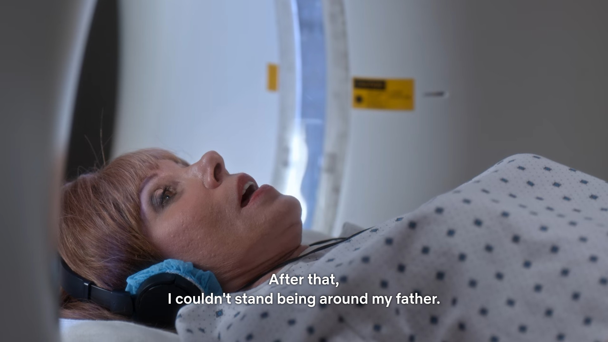
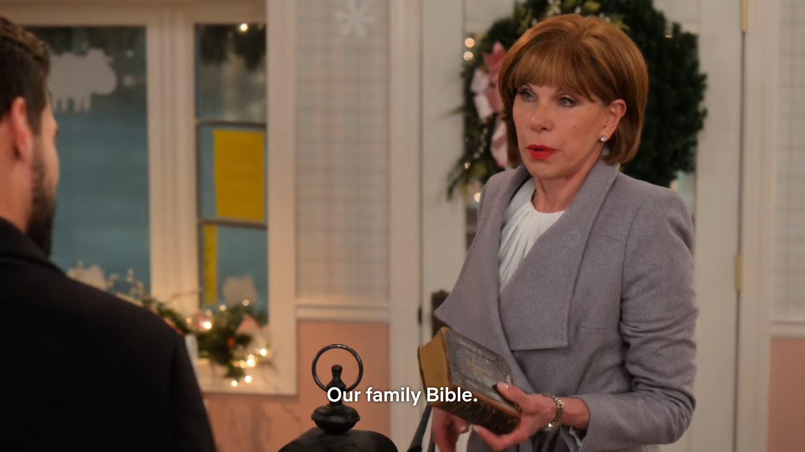
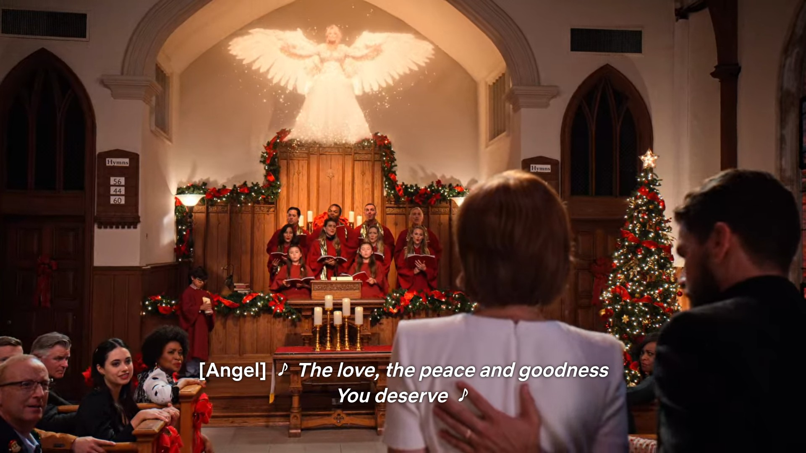

So I first saw _Christmas on the Square_ over Thanksgiving 2020 and wrote most of the first part of this shortly thereafter, but never posted it. When the Christmas Season came around this year I felt I needed to show the movie to Tessa and the second part of this two-part essay is adapted from her takes, which she has bestowed upon me with her blessing.

<!--more-->

Tessa's take is as follows: Jack Fuller was an abusive father and it's wild that the movie essentially deifies him.

# _Christmas on the Square_ as a Hallmark movie

So to recap, Angel visits Regina Fuller and tries to convince her to change her greedy ways. The townsfolk lament that she's not more like her father Jack, who everyone loved because he was big on community and prioritized his tenants' wellbeing over profit. We find out that a lot of the reason Regina is trying to sell Fullerville is because of trauma she endured there as a teen. We find all this out during a nostalgic monologue Regina delivers while on the way to get an MRI done because her doctor thinks she might have cancer (because that's a subplot). Regina's change of heart comes when she realizes, with Angel's help, that her father actually had her best interests at heart and was not abusing her out of malice. The ensuing flashback is where we get most of the exposition into what sort of a guy Jack Fuller really was.

It starts at a high school dance. Regina notes that Jack never let her go to a school dance (for reasons that are meant to be self-evident but not elaborated upon) but made an exception because this was the _Christmas_ dance (his favorite holiday). Regina is there with her boyfriend, Carl (who runs an antiques store in the present day). We found out earlier that they were "sneaking around behind [her] daddy's back", and Regina remarks that "[her] father didn't like the idea of [her] having a boyfriend." This stance is apparently justified because Regina sees Carl showing a ring to another girl in the coat room. Distraught, Regina lets herself be seduced by a boy she's never met. They dance in a metaphor for sex and Regina becomes pregnant. The music at this dance gives us the following very weird, very on the nose lyric:

Regina's new beaux is not named and is never seen again, and no one seems to be mad at _him_ for having sex with Regina. Regina says that before the baby was born the father had moved on to a new girl and a _new town_. What?? A high school boy just roaming from town to town? Or was this an adult-ass man who snuck into a high school dance? My guess is that the movie wants the viewer to understand that this boy was literally Satan, appearing and disappearing at a whim, seducing virgins who are too weak to withstand him. At any rate, Regina failed to be virtuous here the unplanned pregnancy is her fault and not this boy's, _clearly_. Regina remembers this event as her own moral failing rather than as a boy taking advantage of her.

We then get Jack's reaction to Regina's pregnancy. Devastated, "he told [Regina] it would be best if [she] disappeared for a while, so [she] disappeared." It's a bit ambiguous whether Regina had any choice in this but let's be real, she was a teen girl and her dad didn't want her dating or going to school dances, it was probably more of a command. Thus, _Jack Fuller prevents his teenage daughter from being seen in public for the duration of her pregnancy_. We get a scene where Angel intercedes in the flashback, showing Regina something that she did not know: Carl tried to come and see her to apologize (the thing at the dance was a miscommunication, the ring was meant for her). Regina remarks that "_even if [she] had known_ Carl had come to see [her], by then it was too late." I think what she means by this is that she would have been too ashamed to talk to Carl anyway. But Regina does not comment on the _other_ aspect of this scene, which is that Jack _turns Carl away and throws his apology-flowers in the garbage_. It seems like during this time Jack was isolating Regina and cutting her off from her support network, and then never even told Regina that her friends were actually trying to make sure she was ok.

We then flash forward to the birth of Regina's child (abortion would be crossing the moral event-horizon in the eyes of this movie). There's some pretty serious tonal whiplash as Jack rips Regina's newborn from her arms:

That's how the viewer is told they're putting the baby up for adoption. Or at least, Jack was putting the baby up for adoption, because Regina does not seem to be consenting to this, and she apparently hated Jack for this to his dying day:

But then, Dolly Parton steps back in.

So we find out that Jack was not kidnapping Regina's child to _punish_ her, but was in fact, kidnapping Regina's child out of _love_! Newsflash: that's still kidnapping. Grandparents don't just _get_ legal control of their grandchildren if the parent is a minor. According to what I could find on Kansan adoption law, Regina would either need to consent to her father taking custody (which it does not look like she's doing) OR Jack had to [file a petition for guardianship](https://www.kansaslegalservices.org/files/Getting%20Guardianship%20of%20your%20Grandchildren.pdf), which would require a court to declare his perfectly sane, capable daughter unfit to be the child's parent. Wildly, though, Angel's revelation completely 180s Regina's opinion of her dad:

So, to back up, having her baby stolen from her after being socially cut off from everyone in town, coupled with the internalized shame of a teen pregnancy, was so traumatic that Regina left town and did not return until Jack's funeral 30+ years later. Somehow, knowing that Jack did all this out of love and not malice is enough for Regina to both forgive her dad and let go of her shame. The movie frames this all like the revelations recontextualized the situation but... they didn't? From Regina's perspective, Jack still cut her off from her friends and stole her baby and did who knows what with it, but for some reason, she now accepts this behavior as _correct_.

On the topic of Regina's shame: Jack's claim that "small towns have long memories" implies that he thinks the people of Fullerville would be scandalized by Regina's baby and that she'd never live down being a teen mother. First off, Jack, _great_ people you've apparently personally picked to live here. The film in general idolizes and idealizes small-town America so it's interesting that it even acknowledges this oft-repeated trope about small town life. Unless of course, Jack does not think it's a bad thing, and views that sort of gossippy shame-culture in a positive or at least neutral light _unless_ his family is the target of it. We never actually see any of the townsfolk (many of whom knew Regina in childhood) exhibit this sort of behavior (beyond conspiring to beat her ass) and when Regina's son is revealed later they're mostly just excited for Regina to reunite with him. This, coupled with the fact that Regina was _isolated for nine months_, leads me to believe that the shame Regina felt was imposed upon her by Jack only, and that his platitudes about giving her a "fresh start" are bullshit and more about preserving his own reputation than protecting Regina from ostracism.

So Regina gets this vision and we get this exposition, and somehow it makes Regina realize that her dad was actually doing what was best for her, instead of being confirmation that he was incredibly abusive. But there's more, because you see, Regina's son grew up to be... PASTOR CHRISTIAN.

After _this_ revelation is delivered via note Regina finds in her Dad's bible that he hid inside the base of a decorative streetlamp (as you do), Christian mentions Jack in his Christmas sermon. He explains that even though he never knew his birth parents growing up, Jack Fuller always seemed to be watching over him and attending all of his major life events. This paints an absolutely wild picture where, first off, Jack somehow disposed of this baby with zero paper trail. If both Christian and Regina were never able to find out about each other through normal means, this implies that Jack scoured every breadcrumb leading back to Regina's pregnancy in an attempt to protect the Fullers' reputation. [Kansas has a service for getting in touch with one's birth parents/adult adoptee](http://www.dcf.ks.gov/services/PPS/Pages/Adoption-Records-and-Search.aspx), so assuming either Regina or Christian were interested (which they seem to have been since Christian is a big family man and Regina seems to have wanted to raise her child), Jack would have had to somehow get in the middle of that process. But furthermore, Jack denied Regina a relationship with her son, who she _did want to raise_, all the while maintaining a relationship with the boy himself and acting as a surrogate parent behind her back. That is absolutely psychotic behavior.

If it wasn't already clear, _Christmas on the Square_ valorizes all of Jack's abusive behavior, seemingly because of his position in society. Throughout the entire movie Jack is painted as the "good landlord", with all of the townsfolk singing his praises, in contrast to Regina, the "bad landlord", who sucks. Jack was a benevolent philanthropic force who treated everyone in town like family ~~who you collect rent from~~ and who valued the wellbeing of Fullerville's citizens over profit ~~while ruling their town undemocratically~~. Fullerville is "the jewel [Jack] created", etc.

And really, the moral system of the movie rests on the axiom that Jack Fuller can do no wrong. In fact, even when it has the opportunity to show that maybe Jack was not infallible as a means of teaching Regina to forgive or something, it instead opts to have Regina's redemption come only with the realization that her dad was right the whole time, and that she was wrong to have been mad at him in the first place. On top of that, all of Jack's strict parenting decisions are vindicated. He thinks Regina is too young for a boyfriend, the boyfriend seems to cheat on her. He doesn't want Regina going to a school dance, and the devil impregnates her at the first one she goes to. Jack steals Regina's baby and she becomes a successful businesswoman, and the baby grows up to be the de facto leader of Fullerville. If we take _Christmas on the Square_ to be an adaptation of _A Christmas Carol_, then Jack might be the Jacob Marley to Regina's Ebeneezer Scrooge. But this falls apart immediately because where Marley sends Scrooge ghosts to warn Scrooge not to follow in Marley's footsteps, Jack sends Angel to encourage Regina to _follow_ in his footsteps because everything he did worked out great.

So the question kind of is, why is everything Jack does presented as ok? On a lot of levels _Christmas on the Square_ fits the mold of a _Hallmark_ (or even \_Pureflix?) Christmas movie: big city woman visits small town, falls in love with folksy man, learns the true meaning of Christmas (family), and gives up her old life for one of domestic bliss as a housewife. It's a distinctly conservative fantasy where success comes not by overcoming one's obstacles, but by settling back into one's proper place in the social hierarchy, and where disturbing the hierarchy causes chaos. In this sort of a framework Jack aught to have complete control over his family as the father. This is why his behavior is taken as a moral baseline and Regina tends towards sin (premarital sex, evicting the town) when her desires don't align with his. The root of Regina selling Fullerville is her shame, but the root of her shame is framed as a lack of love for her father, from whose control she should never have strayed. Forgiving Jack thus leads directly to Regina cancelling the deal with Cheetah Mall. She is able to reconnect with her son and community only by returning to the path her father laid out for her.

To touch back on Part 1, this is also the reason why "the resistance" to Regina is so weak. Regina's proper place is as owner of the town, and the townsfolk aught to be below her in that hierarchy - evicting the town is Regina's right and everyone just has to plead with her and then accept it because disturbing the social hierarchy is out of the question. Regina is treated more like an immutable force of nature with whom only God can intercede instead of as a fellow human being that can be dealt with. In the case of Jack, his economic "success" as the owner of Fullerville implies an inherent moral virtue, and vise versa: he's in charge because he's virtuous, and he's virtuous because he's in charge. I'm left wondering if this is also why Christian is leading the town even though he isn't the mayor. Is the implication that he has an inherent tendency to lead Fullerville as the heir to the Fuller dynasty?

This kind of stuff is so baked-in to _Christmas on the Square_'s whole genre that I don't think you could modify it without ending up with a completely different movie. I think if you were to rewrite this movie for a whole different audience it could end with Regina still learning the value of community and forgiving her father, but ultimately deciding to forge her own path. Deciding not to evict people and forgiving one's father are not intrinsically linked concepts. Jack would also be a much more interesting character if he had any flaws at all, and/or if the townsfolk came to realize their beloved leader wasn't perfect. But hey, maybe **I** would be a more interesting character if I didn't spend so much brainpower rewriting a made-for-tv musical in my head.

Anyway, that's all I've got on this one folks. I do have more Thoughts about it but I'll let someone else write the post about the weird subplot involving the cute child bartender who Angel definitely makes get hit with by car just to set up an opportunity for Regina to be altruistic. Or how Dolly Parton is totally static in every scene because her old body can't take a ton of moving around. To conclude, I want to say that I don't _hate_ this movie or think it shouldn't exist or something. _Christmas on the Square_ is free on Netflix so if you want to have a surreal Dolly-Parton-based evening, tune in if only for the part where Dolly Parton appears suddenly as a rhinestone-encrusted Christmas tree angel:

